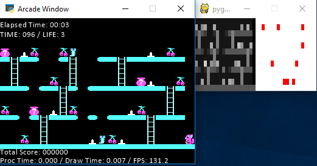

# PyPlat
A flexible platform game project based on Python 3 clone of Bong Bong (1989)

## Description
* Developed for student projects in [CSC 380 Artificial Intelligence](https://computerscience.tcnj.edu/about-the-department/courses-offered/csc-380-artificial-intelligence/) at [The College of New Jersey (TCNJ)](https://tcnj.pages.tcnj.edu/).
* Bong Bong (1989) was originally developed by Lee T.K., while at Computer Science department, [Yonsei University](https://www.yonsei.ac.kr), Seoul, Korea. It was a remake of an arcade game [PONPOKO (ポンポコ) (1982)](https://en.wikipedia.org/wiki/Ponpoko) from Sigma Enterprise, Japan.
* All Python scripts were written from scratch, without referencing the source code of the original 1989 game.
* The purpose of this program is to provide a platformer game, that has discrete decision space, and reasonably medium in scale (not too small and not too large), where students can build and test their own game-playing AI agents.

## Related Arts
* Pac-Man: Adopted in [Berkeley CS188 AI course](http://ai.berkeley.edu). pybongbong is a [platformer](https://en.wikipedia.org/wiki/Platform_game), thus it comes with a bit more complex field than the Pac-Man, and has built-in multiple levels, not too many (only 10). Agent-wise, Pac-Man has more complexity since it has multiple different adversarial strategies for ghosts.
* Super Mario Bros: A popular choice in RL student projects. pybongbong has both discrete decision and environment space model that restricts the search space in general. It is also a perfect information game (with an exception of the bonus bag). It is possible to consider further simplified version of the problem, e.g. no enemies or less number of platforms.
* Obstacle Tower Environment: A Unity-based environment to evaluate and compare RL strategies. Requires a high-level decision making from the agent, multiple levels, and physics based interactions with the environment. Does not have adversarial agents. A [research challenge](https://www.aicrowd.com/challenges/unity-obstacle-tower-challenge) has been orgaznied.

## Dependencies
* [Arcade](http://arcade.academy): Requires Python 3.6+
* [Pygame](https://www.pygame.org): Not required if you don't need real-time game states visualization; On Mac, it is recommended to disable Pygame since it may introduce troubles stem from [Pygame library's multi-thread rendering bug](https://github.com/deepmind/pysc2/issues/2).

## How to Use
* Just run main.py either from command line or within [PyCharm IDE](https://www.jetbrains.com/pycharm/) (recommended).
* To see how to play the game, uncomment lines 104-105 in main.py and watch my replay of the game. You can also watch a walkthrough play of the original 1989 version (with the addicting sound effect) on [Youtube](https://www.youtube.com/watch?v=OAzhfe4VBBc).
* To record a play, uncomment lines 100-101 in main.py. Make sure you comment out lines 104-105 since you can't both record and replay.
* Control
  * Left / Right: Moves left/right
  * Up / Down: Moves up/down the ladder
  * Space: jump
  * S: Take snapshot. Will be saved in ./screenshot subdirectory
  * R: (DEBUG MODE) Reset the game (restart from stage 1)
  * E: (DEBUG MODE) Reset the game (Restart from current stage)
  * C: (DEBUG MODE) Skip the stage

## Terms of Usage
* MIT license for the python scripts. Free for education and research purposes.
* Please feel free to adopt to your AI/ML/PR classes. I am very happy to hear any of your feedback and/or bug report in adopting this. You can find sample programming assignments in [hw_sample.zip](https://github.com/yoonsejong/pybongbong/blob/master/hw_sample.zip).
* I declare no copyright on the art (including image files inside data/ directory and game design information in game_data.py). They belong to the original author (Lee T.K.).

## Known Bugs
* In the original BongBong, the agent could not jump over the enemies. It will automatically die even if there is enough space/time to jump over an enemy. In pybongbong, the agent can actually jump over the enemies.
* There is an unhandled race condition between the AI thread and the game engine thread. When a new stage starts, game state may not have been fully updated due to time consuming stage loading. One may pause the AI module a little during stage switches, or simply add locking in the game engine. (Thanks to Ethan Zeigler for reporting this)

## Future Work
* A technical report is in preparation. Arxiv.org link to the paper will be posted here.
* Bug reports, suggestions, adoption stories into your courses are all welcome!

## Update History
* November 16, 2020 - EAAI-20 version will be available on Dr. Neller's [Model AI Assignments](http://modelai.gettysburg.edu/) collection.
* February 18, 2019 - Added a sample programming assignment.
* December 19, 2018 - Initial Release
